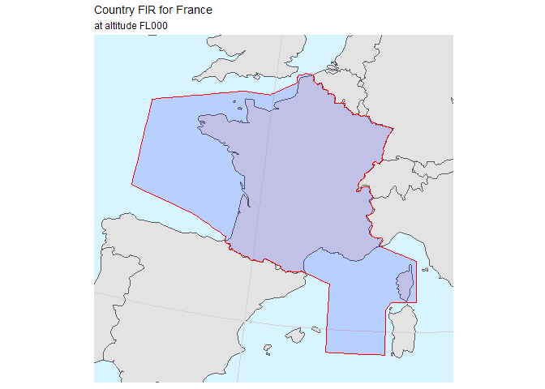

<!-- README.md is generated from README.Rmd. Please edit that file -->
PRU Atlas
=========

The `pruatlas` package provides helpers for generating maps of interest for PRU pubblications.

There are both high and low level facilities. For an example of a high level helper, the code for plotting a map of the French country FIR is just a one-liner:

``` r
library(pruatlas)
plot_country_fir("LF", "France")
```



Lower level functions or datasets include for example `ctrys50m`, the Simple Feature for the whole wolrd countries or `extent_fir()` to calculate the bounding box of a country FIR.

Installation
============

`Pruatlas` is still in early development and it is only available on GitHub. It relies and uses the functionality from the `sf` package and this relies on a working installation of GDAL, see the `sf` installation instructions for directions. Also note that support for Simple Feature is still in development in `ggplot2`: you need to install from GitHub untill officially released (sometine in May 2017.)

In order to install `pruatlas` you need to run:

``` r
library(devtools)
install_github("euctrl-pru/pruatlas")
```

Installation instructions, giving code that can be copied and pasted into R.

An overview that describes the main components of the package. For more complex packages, this will point to vignettes for more details.
